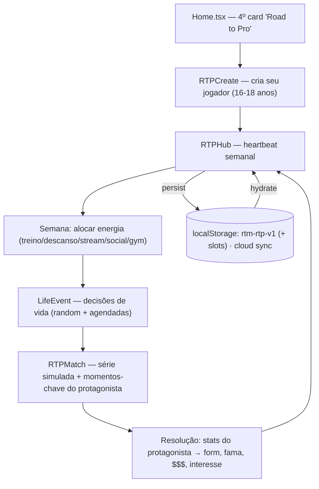
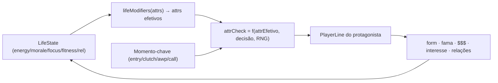
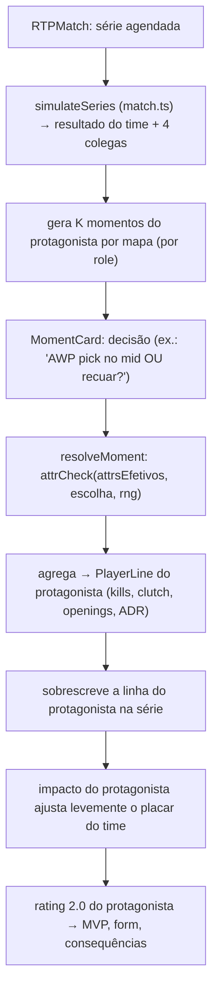

# ROAD TO PRO — Planejamento

> Modo "viva a vida de um jogador de CS", inspirado em *New Star Soccer*. Em vez de
> gerenciar um time, **você É um jogador**: suas decisões off-game (energia, saúde,
> moral, foco, relações, dinheiro) influenciam diretamente o desempenho in-game, e
> suas decisões in-game (momentos-chave de cada partida) moldam sua carreira.
>
> Versão deste doc: 2026-06-30 · branch de planejamento `claude/quizzical-cerf-95fd88`.
> Complementa [ARCHITECTURE.md](../../ARCHITECTURE.md).

---

## Decisões de produto travadas

| Fork | Decisão | Implicação |
|---|---|---|
| **Profundidade na partida** | **Momentos-chave** (decision cards) | A série do time é simulada pelo `match.ts` atual; o protagonista joga N momentos por mapa, resolvidos por checagem de atributo + RNG + modificadores off-game. DNA New Star Soccer. |
| **Escopo de vida off-game** | **Focado** | Energia, fitness (RSI), moral, foco, dinheiro, fama + relações (time, coach, fãs, família/parceiro). Cada medidor decai e acopla no desempenho. |
| **Modelo de save** | **Modo separado** | Nova família `rtm-rtp-v1`, novo card no Home. Zero risco de regressão na Carreira em produção. Migrations próprias. |

---

## Visão geral da arquitetura



O RTP é um **loop semanal** (o "heartbeat"). Cada semana o jogador:
1. **Aloca energia** entre ações (treino com foco em atributo, descanso, stream, socializar, academia, revisar demos…).
2. **Resolve eventos de vida** que aparecem (oferta de stream, lesão no pulso, festa, renovação de contrato, drama no time…).
3. **Joga as partidas agendadas** — a série do time roda no engine atual; o protagonista vive os **momentos-chave**.
4. **Colhe consequências**: form, fama, dinheiro, moral, interesse de transferência, convocações, benching.

Progressão de mundo: **Academia/Open → Tier 2 (Challenger) → Tier 1 → Major → GOAT → aposentadoria** (com gancho pra virar técnico via `coachCareer.ts`).

---

## O que reaproveitamos (não reinventar)

| Sistema existente | Uso no RTP |
|---|---|
| [`engine/attributes.ts`](../../src/engine/attributes.ts) | Os 28 atributos FM-style. Hoje **derivados** via hash; no RTP viram **treináveis e mutáveis** (cada um cresce rumo a um *potential* oculto). `computeOvrFromAttributes` já existe. |
| [`engine/match.ts`](../../src/engine/match.ts) | `simulateSeries` roda a série do time (4 colegas + protagonista). Extraímos a `PlayerLine` do protagonista e a **sobrescrevemos** com o resultado dos momentos-chave. |
| [`engine/ratings.ts`](../../src/engine/ratings.ts) | `playerOvr`, `playerValue`, `playerWage`, `playerTraits` — pra valor de mercado, salário e cards. |
| [`engine/career/personality.ts`](../../src/engine/career/personality.ts) | Personalidade dos **colegas e do coach** (como reagem a você). O protagonista ganha personalidade escolhida na criação. |
| [`engine/chemistry.ts`](../../src/engine/chemistry.ts) | Química **você ↔ cada colega**. Boa relação off-game (socializar) sobe química → bônus na série. |
| [`engine/teamEvents.ts`](../../src/engine/teamEvents.ts) | **Padrão de modal de evento** (fase escolha → fase outcome com chips de delta). Clonamos pra `LifeEventModal`. |
| [`engine/sponsors.ts`](../../src/engine/sponsors.ts) | Ofertas de **patrocínio pessoal** (você, não o time): mousepad, energético, cadeira. |
| [`engine/awards.ts`](../../src/engine/awards.ts) | Prêmios **individuais** de fim de ano (MVP, rookie, breakout) + Hall of Fame. |
| [`engine/aging.ts`](../../src/engine/aging.ts) + [`career/playerAge.ts`](../../src/engine/career/playerAge.ts) | Curva de crescimento/declínio por idade aplicada aos atributos. |
| [`engine/career/market.ts`](../../src/engine/career/market.ts) + [`signings.ts`](../../src/engine/career/signings.ts) | Lógica de ofertas/negociação → adaptada pra **você receber propostas**. |
| [`engine/coachCareer.ts`](../../src/engine/coachCareer.ts) | Aposentadoria → vira técnico (New Game+). |
| [`state/gameStore.ts`](../../src/state/gameStore.ts) + [`saveMigrations.ts`](../../src/state/saveMigrations.ts) + [`cloud.ts`](../../src/state/cloud.ts) | Persistência, migrations versionadas, slots, cloud sync — **mesma infra, namespace novo**. |
| [`engine/league.ts`](../../src/engine/league.ts) / [`career/academyLeague.ts`](../../src/engine/career/academyLeague.ts) / [`swiss.ts`](../../src/engine/swiss.ts) / [`gsl.ts`](../../src/engine/gsl.ts) | Calendário/formatos das divisões baixas até o Major. |
| [`state/achievements.ts`](../../src/state/achievements.ts) | Conquistas específicas do RTP (primeiro Major, GOAT, etc.). |

**Princípio:** o RTP é uma **camada de protagonista** por cima do engine de time existente, não um engine novo. A série continua sendo team-vs-team; nós só damos voz e consequência a 1 dos 10 jogadores.

---

## Modelo de dados (novo save `rtm-rtp-v1`)

```ts
// src/engine/rtp/types.ts (novo)
interface RoadToProSave {
  _v: number;                    // SAVE_VERSION próprio do RTP
  createdAt: number;
  player: ProPlayer;
  life: LifeState;
  team: TeamContext;             // time atual, contrato, role no elenco
  world: WorldState;             // divisão, calendário, semana, temporada
  inbox: RtpEvent[];             // eventos/decisões pendentes
  history: CareerLog;            // stats acumulados, troféus, prêmios
  sponsors: PersonalSponsor[];
  rng: { seed: number; tick: number };  // determinismo (reusa engine/rng.ts)
}

interface ProPlayer {
  id: string; nick: string; name: string; country: string;
  role: Role; role2?: Role; playstyle: Playstyle;
  personality: PersonalityKind;          // escolhida na criação (reusa personality.ts)
  age: number;                           // começa 16-18
  attrs: Record<AttrKey, number>;        // 1-20 MUTÁVEL (treinado) — não mais derivado
  potential: Record<AttrKey, number>;    // teto oculto por atributo (o "PA")
  potentialRevealed: number;             // 0-100 quão visível é o potencial (scouting/coach)
  form: number;                          // 0.85..1.15
  ovr: number;                           // derivado de attrs+role (cache)
}

interface LifeState {
  energy: number;    // 0-100 — moeda principal do loop semanal
  fitness: number;   // 0-100 — saúde física; baixo = risco de RSI/lesão
  morale: number;    // 0-100 — mental; breakup/derrota derruba
  focus: number;     // 0-100 — concentração; festa/distração derruba
  fame: number;      // 0-100 — fãs/mídia
  money: number;     // R$
  rel: {             // relações 0-100
    team: number; coach: number; fans: number; family: number; partner: number;
  };
  flags: {           // estados especiais
    injured?: { kind: 'wrist' | 'back' | 'burnout'; weeksLeft: number };
    onStreak?: number;   // série de boas/más partidas
    contractAnxiety?: boolean;
  };
}

interface TeamContext {
  teamId: string; teamName: string; tag: string;
  tier: 'academy' | 'challenger' | 'tier1' | 'elite';
  squadRole: 'star' | 'starter' | 'rotation' | 'bench';
  contract: { wage: number; weeksLeft: number; buyout: number };
  teammates: TPlayer[];          // 4 colegas (reusa geração existente)
  chem: Record<string, number>;  // você ↔ cada colega (reusa chemistry.ts)
}

interface WorldState {
  season: number; week: number;  // semana dentro da temporada
  schedule: ScheduledMatch[];     // calendário da divisão
  division: string;               // id da liga/circuito
  standings?: ...;                // tabela (reusa league.ts)
  transferWindowOpen: boolean;
}
```

**Crescimento (training):** cada atributo sobe rumo ao `potential[k]` com:
- retornos decrescentes perto do teto,
- **age curve** (jovem cresce rápido; após ~27 declina — reusa `aging.ts`),
- **penalidade de fadiga** se `energy` baixa no momento do treino,
- bônus de coach (relação + rating do coach).

---

## Acoplamento OFF-GAME → IN-GAME (o coração do pedido)

Cada medidor de vida vira um **multiplicador efetivo** nos atributos durante a resolução dos momentos-chave (não muda os atributos base — é estado temporário):

| Medidor baixo | Penaliza | Efeito narrativo |
|---|---|---|
| **Energy** | aim, reflexes, reaction | "Você jogou cansado, reação lenta." |
| **Morale** | composure, clutch | "Tilt — errou o clutch fácil." |
| **Focus** | concentration, consistency, gameSense | "Distraído, lapso de leitura." |
| **Fitness** | stamina (mapas longos) + gatilho de **lesão** | "Pulso doendo no 3º mapa." |
| **rel.team** baixo | química → força do time na série | "Sem entrosamento, jogada quebrou." |
| **rel.coach** baixo | menos ganho de treino + piores calls | — |

E o inverso premia: energia alta + boa forma + química alta = **clutch performance** (carrega o time). Boa relação com fãs/mídia → mais fama → melhores patrocínios → mais dinheiro → melhor setup → leve bônus.



---

## Camada de partida — momentos-chave



**Momentos por role** (o que aparece como decisão):
- **Entry**: abrir o bombsite (peek agressivo vs. esperar flash do colega).
- **AWP**: hold de ângulo arriscado vs. reposicionar; pick de abertura.
- **Lurker**: flanco solo vs. agrupar; leitura de rotação.
- **IGL**: call de mid-round (forçar B vs. fake e virar A) — afeta o **time todo** na simulação.
- **Support**: util perfeito (trade garantido) vs. frag próprio arriscado.
- **Clutch (qualquer role)**: 1vX — sequência de micro-decisões.

`resolveMoment` = checagem de atributo relevante (modulado por life) × dificuldade do momento × RNG determinístico (`engine/rng.ts`). Resultado vira frags/clutch/morte e alimenta a `PlayerLine`. A soma vira **rating 2.0** do protagonista, que (a) decide MVP, (b) ajusta `form`, (c) dispara consequências.

**Velocidade:** modo rápido (auto-resolve momentos com sua "tendência" pré-setada) pra quem quer simular várias semanas, ou manual momento-a-momento. Reusa a ideia de speed control do online.

---

## Eventos de vida (sabor New Star Soccer)

Clonamos o padrão de [`teamEvents.ts`](../../src/engine/teamEvents.ts) → `engine/rtp/lifeEvents.ts`. Cada evento: 2-4 escolhas com deltas em `life.*`. Categorias:

- **Carreira**: oferta de outro time, renovação de contrato, mudança de role, bootcamp no exterior (jetlag → -focus).
- **Saúde**: dor no pulso (jogar vs. descansar → risco de RSI), burnout, recomendação de fisio.
- **Pessoal**: relacionamento (encontro, marco, briga, término → -morale), família (emergência, visita), mudança de cidade/casa.
- **Mídia/fama**: convite de stream (+$ +fama, -energy), entrevista (pode subir/descer fama conforme `composure`), clipe viral, polêmica no Twitter (escolha de resposta).
- **Time**: colega tóxico (confrontar vs. ignorar → afeta `rel.team` e química), disputa de role, vitória/derrota marcante.
- **Dinheiro**: compra de setup (bônus pequeno), oportunidade de investimento, contrato de patrocínio pessoal (`sponsors.ts` adaptado).

Eventos são **agendados** (renovação no fim do contrato) ou **aleatórios** (probabilidade modulada por estado — moral baixa puxa eventos negativos; fama alta puxa convites).

---

## Telas (UI) — todas novas, isoladas do monólito

| Tela | Papel | Reaproveita |
|---|---|---|
| `RTPCreate` | Criação do jogador: nick, país, role, playstyle, personalidade, distribuição inicial de atributos (orçamento de pontos). | `ds/` (Modal, Button, Panel), `attributes.ts` (árvore visual). |
| `RTPHub` | Heartbeat: medidores de vida no topo, calendário, ações da semana, inbox. | `DashCard`, `Sparkline`, `CareerIcon`. |
| `RTPTrain` | Aloca energia em treino/descanso/stream/gym/social/demos. | — |
| `RTPMatch` | Série + momentos-chave (decision cards). | `match.ts`, scoreboard estilo HLTV existente. |
| `RTPProfile` | Árvore de 28 atributos, potencial revelado, form, histórico, troféus. | `attributes.ts`, `awards.ts`. |
| `LifeEventModal` | Eventos de vida (fase escolha → outcome). | padrão `TeamEventModal`. |
| `RTPTransfer` | Ofertas recebidas, negociação de salário/role/buyout. | `market.ts`, `signings.ts`. |
| `RTPSeasonEnd` | Prêmios individuais, resumo da temporada, Hall of Fame. | `awards.ts`, `HallScreen`. |

Integração no `Home.tsx`: 4º `rtm-modecard` (tone novo, ex.: roxo) chamando `onRoadToPro()`. Rota nova via padrão incremental do `App.tsx` (Screen union → depois React Router no T1.4).

---

## Fases de implementação (RTP1 … RTP8)

Sequência pensada pra **cada fase ser jogável/demonstrável** ao fim (vertical slices), não camadas horizontais.

### RTP1 — Esqueleto + save + criação *(fundação)*
- `engine/rtp/types.ts`, save `rtm-rtp-v1` no gameStore com slots próprios + 1 migration inicial.
- `RTPCreate` (cria jogador, gera time inicial de academia com 4 colegas via geração existente).
- `RTPHub` placeholder com medidores de vida.
- 4º card no Home + rota.
- **Entregável:** criar um jogador, ver o hub, save/load funcionando.

### RTP2 — Loop semanal + treino + crescimento
- Sistema de energia/ações da semana (`RTPTrain`).
- Modelo de crescimento de atributos (potential + age curve + fadiga + coach).
- Avanço de semana (tick) com decay dos medidores.
- **Entregável:** passar semanas, treinar, ver atributos subindo rumo ao potencial.

### RTP3 — Partida com momentos-chave
- `engine/rtp/protagonist.ts` (geração + resolução de momentos por role).
- `lifeModifiers` (off-game → atributos efetivos).
- `RTPMatch`: roda `simulateSeries`, sobrescreve a linha do protagonista, agrega rating 2.0.
- Modo rápido vs. manual.
- **Entregável:** jogar uma série vivendo seus momentos; bom/mau desempenho conforme estado de vida.

### RTP4 — Consequências + form + calendário de divisão
- Form, fama, dinheiro, interesse pós-partida.
- Calendário da divisão academia/challenger (reusa `league.ts`/`academyLeague.ts`), standings.
- Benching/promoção conforme desempenho.
- **Entregável:** uma temporada de divisão de baixo, com altos e baixos baseados no seu jogo.

### RTP5 — Eventos de vida
- `engine/rtp/lifeEvents.ts` + `LifeEventModal`.
- Eventos agendados + aleatórios modulados por estado.
- Lesões (RSI/burnout) e recuperação.
- **Entregável:** o roleplay off-game completo, acoplado ao desempenho.

### RTP6 — Mercado, contratos e progressão de tier
- `RTPTransfer`: ofertas, negociação, buyout, mudança de role/time.
- Subir de tier (challenger → tier1 → Major qualificação via swiss/gsl).
- Patrocínios pessoais (`sponsors.ts` adaptado).
- **Entregável:** carreira ascendente, do desconhecido ao Major.

### RTP7 — Fim de temporada, prêmios, Major e GOAT
- `RTPSeasonEnd`: prêmios individuais (`awards.ts`), Hall of Fame.
- Major completo como protagonista (reusa Hub/swiss/gsl).
- "GOAT score" / legado; conquistas RTP (`achievements.ts`).
- **Entregável:** o arco completo até o topo, com recompensa de prestígio.

### RTP8 — Aposentadoria, New Game+ e polish
- Declínio por idade → aposentadoria.
- Gancho aposentadoria → técnico (`coachCareer.ts`) ou novo jogador.
- Balanceamento, i18n (pt/en/es), cloud sync, tutorial/onboarding.
- **Entregável:** ciclo de vida fechado e modo polido.

---

## Riscos e mitigações

| Risco | Mitigação |
|---|---|
| **Balanceamento** do acoplamento off→in (fácil demais / punitivo demais) | Modificadores como multiplicadores suaves (±10-15%), não binários. Tunar em RTP3/RTP8 com seeds fixas. |
| Momentos-chave virarem repetitivos | Variar por role, mapa, lado, contexto de round e estado emocional; pool grande de textos (padrão `narration.ts`). |
| Atributos mutáveis quebrarem premissa "derivados" do `attributes.ts` | RTP usa `attrs` como **campo persistido** próprio; só reaproveita as funções de OVR/UI, não a derivação por hash. Carreira atual fica intacta. |
| Escopo grande | Fatiamento vertical: cada RTP entrega algo jogável; dá pra parar em qualquer fase com um produto coerente. |
| Determinismo (save/replay) | Tudo via `engine/rng.ts` semeado no save; nada de `Math.random` solto. |
| Regressão na Carreira | Save e telas 100% separados; só funções puras são compartilhadas. |

---

## Decisões em aberto pra depois (não bloqueiam RTP1)

- Quantos momentos-chave por mapa (sugestão inicial: 3-5, escala com tier).
- Granularidade do orçamento de pontos na criação (build "prodígio especialista" vs. "equilibrado").
- Modo rápido auto-resolve usa "tendência" salva ou perfil de risco por role?
- Stream/creator vira subsistema leve já no RTP5 ou fica como evento simples?
- Multiplayer/leaderboard de GOAT score (provável T4 / fora do MVP).
