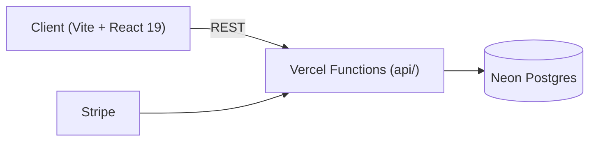
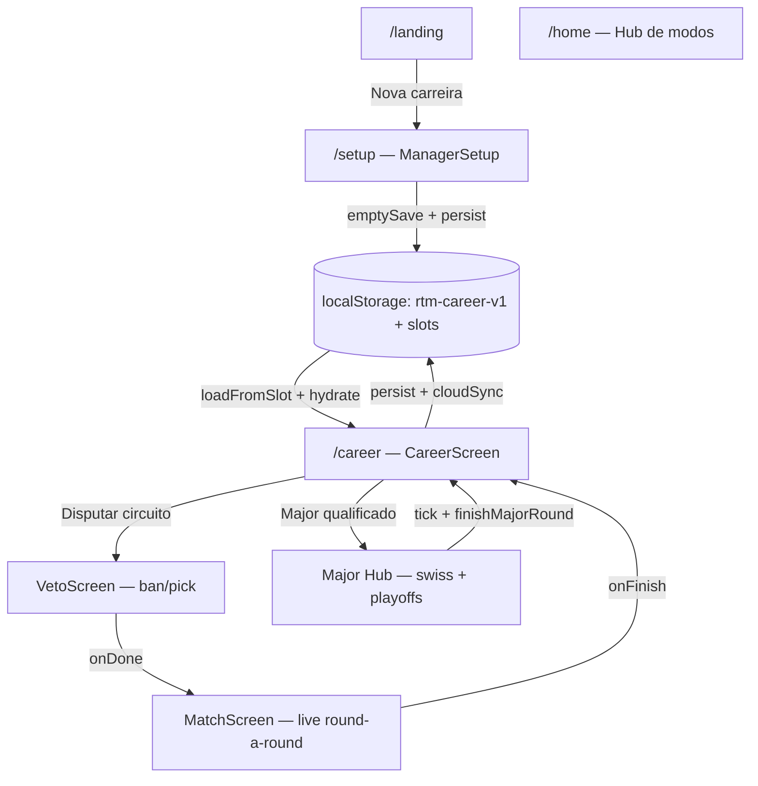
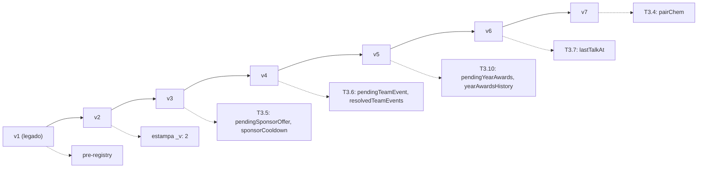
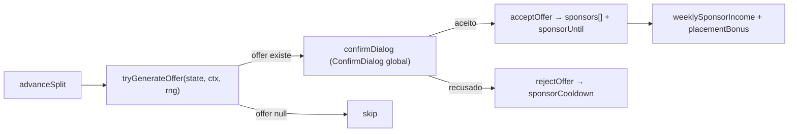
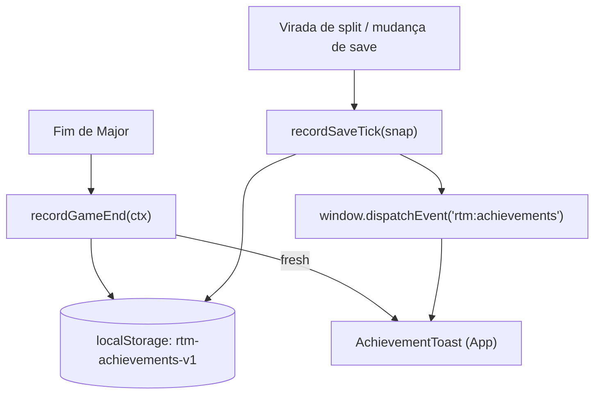
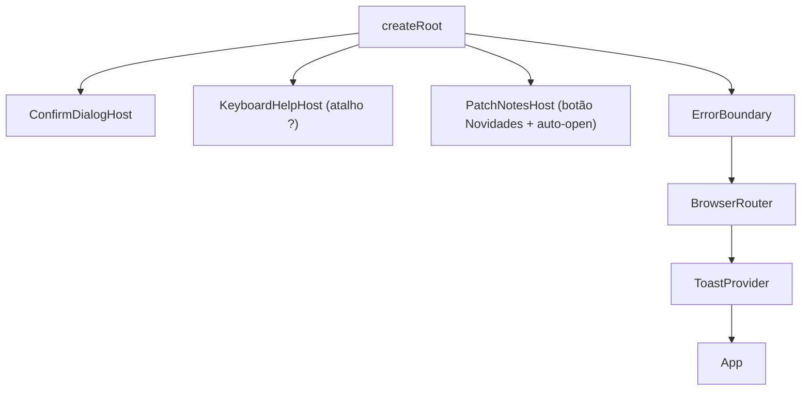
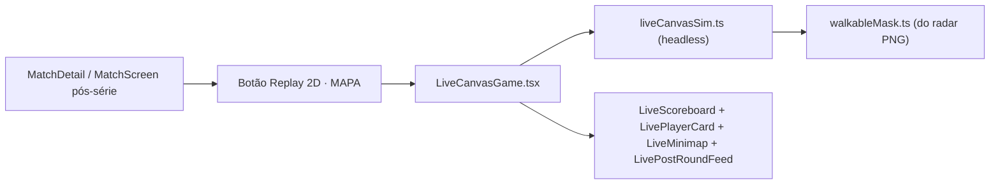

# MAJOR//CS — Arquitetura

Documento de orientação pra entender como o projeto se organiza, os fluxos principais e onde encontrar cada coisa. Complementa o `README.md` e os comentários inline.

> Versão deste doc: 2026-06-26 (após T3.14). Cobre os sistemas T3 implementados nesta branch (`feat/new-visual-ui-ux`). Roadmap completo: [.claude/plans/faca-um-planejamento-para-piped-quilt.md](.claude/plans/faca-um-planejamento-para-piped-quilt.md).

---

## Visão geral

MAJOR//CS é um simulador de gerência de Counter-Strike inspirado em *Football Manager* e *Brasfoot*. O projeto tem 3 camadas:



- **Client** (`src/`) — SPA React 19 + Vite. Sozinho roda offline (saves locais via `localStorage`).
- **API** (`api/`) — Vercel functions pra cloud-save, ranking, accounts, Stripe webhook.
- **Banco** — Neon Postgres (cloud-save, contas, leaderboard).

## Stack

- React 19 + TypeScript ~6
- Vite 8 + Vite plugin react
- **Zustand 5** (T1.1 — `gameStore` central + migrations versionadas)
- **React Router 7** (T1.2 — wrapper inerte, telas migram incremental)
- **Recharts + lucide-react** (T2.2 — Sparkline + ícones)
- Tokens de design `--rtm-*` + `em-*` (CSS vars, light/dark prep)
- Neon serverless driver (postgres)
- Stripe Node SDK

---

## Estrutura do client

```
src/
  App.tsx              # rotas legacy (Screen union) + BrowserRouter wrapper
  main.tsx             # root render: ConfirmDialogHost, KeyboardHelpHost, PatchNotesHost, ErrorBoundary, BrowserRouter, ToastProvider
  components/          # UI compartilhada — sub-pastas em ds/, live/, career/
    ds/                # Design system (Modal, Toast, Button, Panel, DashCard)
    live/              # Canvas 2D (T2.5 piloto + UI in-game)
    career/            # CareerPlayerPage, CareerIcon, ChemistryMatrix
    modals/            # planejado (não criados ainda; placeholders em CareerScreen)
    CareerScreen.tsx   # MONOLITO (7k+ linhas) — 15 abas. Quebra prevista no T1.4
    OnlineScreen.tsx   # MONOLITO online (2.6k linhas) — quebra futura
  engine/              # Lógica determinística do jogo
    match.ts           # simulateSeries (sigmoid de força + map swing + stance/IGL)
    swiss.ts gsl.ts    # formatos de torneio
    veto.ts            # ban/pick de mapas
    narration.ts       # texto pós-round
    ratings.ts         # OVR, playerValue, playerWage, buildUserTeam
    career/            # facilities, fatigue, market, rivalries, signings, personality
    sponsors.ts        # T3.5
    teamEvents.ts      # T3.6
    awards.ts          # T3.10
    playerTalks.ts     # T3.7
    chemistry.ts       # T3.4
    analystReport.ts   # T3.13
  state/               # Stores e persistência
    gameStore.ts       # T1.1 — zustand store central (delegação de I/O)
    saveMigrations.ts  # T1.1 — registry de migrations (SAVE_VERSION=7)
    careerSaves.ts     # 5 slots manuais (legacy, agora delegado pro gameStore)
    cloud.ts           # sync com api/cloud-save
    achievements.ts    # T3.14 — recordGameEnd + recordSaveTick + COND/COND_SAVE
    i18n.tsx           # 3 idiomas (pt/en/es) — substituição prevista no T5.1
    career-strings.ts  # 1876 linhas de strings (subsitui no T5.1)
  data/                # Datasets estáticos
    teams.json bo3.ts  # times reais
    sponsors.ts        # T3.5 catálogo (legacy + extensão)
    mapGeometry.ts     # T2.5 layouts dos 7 mapas + radar PNG
    patchNotes.ts      # T6.3
  lib/                 # Utilitários puros
    liveCanvasSim.ts   # T2.5 engine 2D headless
    walkableMask.ts    # T2.5 mask do radar (anti-fly)
  hooks/
    useKeyboardShortcuts.ts  # T2.3
api/                   # Vercel functions
  account.ts cloud-save.ts ranking.ts admin-accounts.ts beta.ts ...
public/maps/           # PNGs dos radares CS2 (T2.5 — fonte: 2mlml/cs2-radar-images)
```

---

## Fluxo de uma carreira



### Slots de save

Existem 5 slots. Slot 1 = `rtm-career-v1` (key legada). Slots 2-5 = `rtm-career-v1__s2..s5`. Cloud sync via `state/cloud.ts` (last-write-wins por timestamp). Tombstone deletion implementado.

### SAVE_VERSION + migrations

`state/saveMigrations.ts` mantém registry. Cada migration recebe save `vX` e devolve `vX+1`.



Backfill conservador — nada é REMOVIDO. Save antigo abre, migra silenciosamente em cadeia.

---

## Sistemas implementados (T3 — 57% completo)

### T3.5 — Patrocinadores ([sponsors.ts](src/engine/sponsors.ts))



- Catálogo: Logitech, HyperX, Razer, Secretlab, Monster, Intel, Red Bull, Samsung
- Oferta dinâmica modulada por VRS + tier + slots
- Cooldown 2 splits após recusa
- Bônus por placement (major = 2× perSplit, top4 = 25%, top8 = 8%)

### T3.6 — Eventos de time ([teamEvents.ts](src/engine/teamEvents.ts))

13 eventos em 5 categorias: `internal` (briga, reserva insatisfeito), `media` (clipe viral, scandal), `commercial` (sponsor visita, merch), `training` (bootcamp, novo método), `staff` (oferta de coach, analista pede recursos).

Cada evento tem 2-4 escolhas com deltas em **budget / morale / board**. UI: `TeamEventModal` com fase 1 (escolha) → fase 2 (outcome com chips de delta).

### T3.10 — Year-end awards ([awards.ts](src/engine/awards.ts))

A cada 4 splits = 1 ano. 5 categorias: `mvp`, `rookie`, `mostImproved`, `coachOfYear`, `breakout`. Modal slide-a-slide cinematográfico.

### T3.7 — Player Talks ([playerTalks.ts](src/engine/playerTalks.ts))

6 tópicos (playtime, effort, defend, behavior, extension, praise) × 3 tons (firm, friendly, motivational) = 18 combinações com narrativa dedicada.

Matriz determinística + modificadores: idade, moral atual, **personality** (T3.2 — leader/mercenary/prodigy/hothead/resilient cada um responde diferente).

Cooldown 2 splits por player.

### T3.4 — Chemistry ([chemistry.ts](src/engine/chemistry.ts))

Modelo de par: `pairChem[sortedA|sortedB] = 0..100`. Default ausência = 30. UI: matriz 5x5 heatmap em `ChemistryMatrix.tsx` na aba Squad.

- **Tick após série jogada**: +2 por par dos starters + 1 bônus se venceu
- **Decay no split**: -1 em todos os pares
- **Personality bonus** (T3.2): leader = 1.4×, resilient = 1.15×, mercenary = 0.8×, hothead = 0.7×
- **chemistryMatchModifier(avg)** = 0.95 + (avg/100)*0.10 → 0.95-1.05 no team strength (integração no engine de match planejada)

### T3.2 — Personality ([engine/career/personality.ts](src/engine/career/personality.ts))

5 personalities derivadas via hash determinístico (sem campo no save):
- `leader` — aceita firme bem, sobe química rápido
- `mercenary` — desconta praise/friendly, frio com time
- `prodigy` — motivacional rende muito, firme dói
- `hothead` — reações dobradas, atrapalha química
- `resilient` — atenua tudo, fácil de conviver

Integrado em `playerTalks.resolvePlayerTalk` (modula delta final) e `chemistry.tickPairChemAfterMatch` (média dos modifiers do par).

### T3.13 — Analyst Report ([analystReport.ts](src/engine/analystReport.ts))

Card visual ([AnalystReportCard](src/components/AnalystReportCard.tsx)) renderizado no VetoScreen antes do ban/pick começar. Mostra:
- Threat level 1-5 (avg OVR top 5)
- Narrativa contextual de 3-4 frases
- Star player + elo fraco
- Ban prioritário (maior `oppPref - myPref`) + Pick recomendado
- Warning de roles ausentes (AWP/IGL/Entry)

### T3.14 — Achievements expansion ([achievements.ts](src/state/achievements.ts))

28 conquistas totais (10 legadas + 18 novas). Duas vias de disparo:



Conquistas novas: sponsors (3), events (2), talks (2), awards (2), chemistry (2), finanças (4), longevidade (2), promoção tier (1).

---

## Sistemas globais montados na raiz

[main.tsx](src/main.tsx) monta hosts globais que vivem **fora** do ErrorBoundary pra continuarem funcionando mesmo quando a árvore principal crasha:



---

## Live match canvas (T2.5 — pausado)

Sistema de broadcast 2D ao vivo. Recebe `MapResult` já simulado e replaya com agents andando, plant/defuse, kills do `killFeed`.



**Status:** piloto funcional. 7 radares CS2 calibrados em `public/maps/de_<mapa>_radar.png` (1024×1024 do repo [2mlml/cs2-radar-images](https://github.com/2mlml/cs2-radar-images)). UI in-game completa (scoreboard topo + player cards + narração + minimap).

**Pendências (RETOMAR em outra sessão):** agents ainda erráticos (walkable mask precisa calibração por mapa), A* pra contornar paredes maiores, smoke/flash visuais, vertical sections (Nuke/Train lower), som.

---

## Convenções

- **Comentários em PT** pra contexto/decisões (não traduzir)
- **Código em EN** (variáveis, types, function names)
- **CSS variables** `--em-*` / `--rtm-*` pra tokens dependentes do tema — nunca `#xxx` hardcoded inline (quebra light mode futuro)
- **Memory** `[autonomous-execution]` — executar subtarefas em sequência dentro de um tier; consultar só em decisões de produto ou fim de tier
- **Token-conscious** ([token-conscious]) — evitar campanhas multi-agente sem aprovação

---

## Como adicionar uma...

### Conquista nova

Editar [src/state/achievements.ts](src/state/achievements.ts):
1. Adicionar entry em `ACHIEVEMENTS` (id, icon, t.pt/en/es)
2. Adicionar predicate em `COND` (Major-end) OU `COND_SAVE` (snapshot do save)
3. Se `COND_SAVE`, garantir que o campo derivado existe em `SaveSnapshot` + atualizar `buildAchievementSnapshot` no CareerScreen

### Migration nova (mudança de schema)

1. `SAVE_VERSION += 1` em `saveMigrations.ts`
2. Adicionar `MIGRATIONS[N] = (save) => ({ ...save, /* novos campos */, _v: N+1 })`
3. Comentar O QUÊ e PORQUÊ — futuras sessões dependem de entender
4. Testar abrindo save criado N versões atrás

### Sponsor / Team Event / Award / Talk topic

Editar os respectivos arrays/maps:
- Sponsor: `SPONSORS` em [data/sponsors.ts](src/data/sponsors.ts)
- Team event: `TEAM_EVENTS` em [engine/teamEvents.ts](src/engine/teamEvents.ts)
- Award category: adicionar `AwardKind` em [engine/awards.ts](src/engine/awards.ts) + handler em `detectYearAwards`
- Talk topic: `TALK_TOPICS` + cases em `buildOutcomeText` em [engine/playerTalks.ts](src/engine/playerTalks.ts)

### Página nova (incremental, T1.2 não migrou tudo ainda)

1. Adicionar `Screen` union em [App.tsx](src/App.tsx) (linha ~85)
2. Adicionar `SCREEN_PATH` + `PATH_SCREEN` mapping
3. Renderizar condicionalmente: `{screen === 'xxx' && <YourScreen ... />}`
4. **Quando T1.4 migrar pra react-router de verdade**, virar `<Route path="/xxx" element={<YourScreen/>} />`

---

## Estado do roadmap

| Tier | Status | % |
|---|---|---|
| T1 — Desbloqueio (router + store + modais + quebrar CareerScreen) | parcial | ~17% |
| T2 — UI/UX (TopBar, charts, atalhos, canvas live) | T2.2+T2.3+T2.5 piloto | ~44% |
| T3 — Profundidade FM-style | **8/14** | **~57%** |
| T4 — Backend social | não iniciado | 0% |
| T5 — i18n completo | não iniciado | 0% |
| T6 — Engenharia (testes, scrapers, patch notes, **doc**) | T6.3 + T6.4 (este) | ~50% |
| T7-T11 — Polish/Cosméticos/Modais | não iniciado | 0% |
| T12 — BUT (modo paralelo) | não iniciado | 0% |

**Total estimado:** ~15% (35 / 233 dias do plano original).

Sessão recente cobriu 8 sub-tiers do T3 (sponsors, team events, year awards, player talks, chemistry, personality, analyst, achievements) + T6.3 patch notes + T6.4 este doc.

---

## Pendências grandes

| Item | Por quê está adiado | Trigger pra retomar |
|---|---|---|
| **T1.4** quebrar `CareerScreen.tsx` em 15 pages | Trabalho repetitivo (~15 dias); requer react-router de verdade | Quando UI quiser TopBar/Inbox renovada |
| **T2.5+** canvas 2D: A*, walkable mask por mapa, smoke/flash, som | Pausado pelo user (sessão dedicada) | Quando voltar a focar no broadcast |
| **T1.1 5b** substituir `useState<CareerSave>` por `useGame()` | Risco em re-renders do monolito; melhor junto com T1.4 | Junto com T1.4 |
| **T5.1** mover i18n pra dicionários | 1876 linhas de strings legacy | Quando adicionar idioma novo |
| **T3.1** 28 atributos FM-style | Grande mudança no Player; engine de match precisa adaptar | Próxima fase de profundidade |
| **T4** Backend social (chat, follow, public saves) | Sem demanda atual | Quando comunidade ativar |
