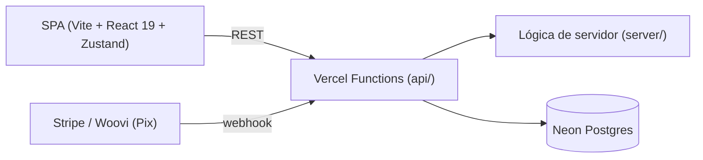

# MAJOR//CS — Arquitetura

Mapa curto de como o projeto se organiza e onde fica cada coisa. O vocabulário
de domínio (Sala, Beat, Momento, Virada de semana…) está no
[CONTEXT.md](CONTEXT.md); o `README.md` cobre como rodar.

> Versão deste doc: 2026-09-23. As versões de save abaixo são conferidas contra
> o código por `scripts/test-docs-versions.mts`: quem sobe uma versão e não
> atualiza este doc quebra o `npm run test:sim`.

---

## Visão geral


```mermaid
flowchart LR
    Client["SPA (Vite + React 19 + Zustand)"]
    API["Vercel Functions (api/)"]
    Server["Lógica de servidor (server/)"]
    DB[("Neon Postgres")]
    Pay["Stripe / Woovi (Pix)"]

    Client -->|REST| API
    API --> Server
    API --> DB
    Pay -->|webhook| API
```

- **Client** (`src/`): SPA. Os saves vivem no `localStorage`; conta paga tem
  cloud-save. A simulação roda no navegador com RNG semeado.
- **API** (`api/`): uma função por arquivo (conta, cloud-save, ranking, lobby,
  economia do Ultimate, Weekend League, live-ops, Hall, métricas, webhooks de
  pagamento, admin). `api/_*.ts` são helpers, não rotas.
- **Server** (`server/`): lógica pura e testável que as funções usam (economia
  e mercado do Ultimate, packs, Weekend League, live-ops, pagamentos, codec do
  cloud-save). Os testes ficam ao lado (`server/*.test.ts`, `npm test`).
- **Banco**: Neon Postgres (contas, cloud-save, ranking, ledger do Ultimate,
  live-ops). Migrações manuais em `scripts/migrations/`.

## Stack

- React 19 + TypeScript ~6 + Vite 8
- Zustand 5 (`gameStore` da Carreira, store do Ultimate)
- React Router 7 só como wrapper: a navegação real é o `Screen` do `App.tsx`
  com `history.pushState` (veja "Rotas")
- lucide-react para ícones
- Neon serverless driver, Stripe SDK, nodemailer

---

## Modos de jogo × arquivos

| Modo | Rota | Tela (UI) | Engine | Estado / save |
|---|---|---|---|---|
| Major (draft clássico) | `/jogo/*` | `Draft`, `Hub`, `VetoScreen`, `MatchScreen`, `FinalScreen` | `match.ts`, `veto.ts`, `swiss.ts`, `gsl.ts`, `ratings.ts` | sessão (transiente) |
| Carreira (manager) | `/carreira`, `/carreira/jogador/:id`, `/carreira/time/:id` | `CareerScreen` + abas em `src/pages/career/` + `src/components/career/` | `src/engine/career/`, `sponsors.ts`, `teamEvents.ts`, `awards.ts`, `chemistry.ts`, `playerTalks.ts` | `gameStore.ts` + `saveMigrations.ts`, slots em `careerSaves.ts` |
| Road to Pro (jogador) | `/road-to-pro` | `src/components/rtp/` | `src/engine/rtp/` (Sala em `room.ts`) | `rtpSaves.ts` |
| Ultimate Team | `/ultimate` | `src/components/ultimate/` | `src/engine/ultimate/` | `state/ultimate.ts` (local) + `ultimateShadow.ts` (servidor autoritativo) |
| Diário (minigames) | `/diario` | `src/components/daily/` | `src/engine/daily/` | `state/daily.ts`, `dailyStreak.ts` |
| Online (legado) | `/online` → cai na Home | `OnlineScreen`, `src/components/online/` | `state/online.ts` | servidor (`api/lobby.ts`, `api/ranking.ts`) |
| Hall da Fama | `/hall` | `HallScreen` | `hall.ts` | `api/hall.ts` |
| Admin / CRMs | `/admin/*` | `Admin`, `*CRM.tsx`, `LabScreen` | — | `api/admin-*.ts`, `api/liveops.ts` |

## Estrutura de pastas

```
src/
  App.tsx          # union Screen + SCREEN_PATH (rotas) + montagem das telas
  main.tsx         # hosts globais (ConfirmDialog, atalhos, patch notes), ErrorBoundary, BrowserRouter
  components/      # telas e UI; sub-pastas por modo (career/, rtp/, ultimate/, daily/, online/, live/, ds/)
  pages/           # páginas da Carreira extraídas do monolito (career/*Tab.tsx) e páginas avulsas
  engine/          # lógica pura e determinística (sem Math.random/Date.now; lint garante)
    career/ rtp/ ultimate/ daily/ bridge/
  state/           # stores, persistência, cloud, i18n, chamadas de API
  data/            # datasets estáticos (times, catálogos, mapas)
  styles/          # CSS por modo; tokens em src/index.css
  lib/             # utilitários puros (canvas 2D, logo builder)
  hooks/
api/               # Vercel Functions
server/            # lógica de servidor + testes (npm test)
scripts/           # test-*.mts (npm run test:sim), geradores, migrações SQL
sim/               # balanceamento offline
public/            # único diretório servido como estático (logos/, maps/, ads/)
docs/              # planos e referências; docs/marketing/ para posts e media kit
```

## Rotas

`SCREEN_PATH` (em `App.tsx`) liga cada `Screen` a um path; a navegação usa
`history.pushState`/`popstate`. Como é SPA, **todo path precisa de rewrite no
`vercel.json`**, senão o F5 dá 404 na Vercel. `scripts/test-vercel-rewrites.mts`
confere isso para todo `SCREEN_PATH` e para os deep links da Carreira.

## Versões de save

Cada save guarda a própria versão em `_v` e migra em cadeia até a atual, sempre
com backfill (nada é removido).

| Save | Constante | Arquivo | Chave no localStorage |
|---|---|---|---|
| Carreira | `SAVE_VERSION = 29` | `src/state/saveMigrations.ts` | `rtm-career-v1` (+ slots `__s2..s5`) |
| Road to Pro | `RTP_SAVE_VERSION = 17` | `src/engine/rtp/createSave.ts` | `rtm-rtp-v1` |
| Ultimate | `ULTIMATE_VERSION = 1` | `src/engine/ultimate/state.ts` | `rtm-ultimate-v1` |
| Draft (campanha) | `DRAFT_SESSION_VERSION = 2` | `src/state/draftSession.ts` | `major-session-v3` |

Migração nova na Carreira: `SAVE_VERSION += 1` em `saveMigrations.ts`, registre
a função `vN → vN+1`, cubra em `scripts/test-save-migration.mts` e atualize a
tabela acima.

Realismo FM fase 3 (pessoas e mercado): Carreira v29 grava o bloco `clube` (vestiário com
status/banco/escalação, contratos completos, negociações em rodadas e mercado da IA) —
contrato em `src/engine/clube/model.ts`.

Realismo FM fase 2 (gestão do time): Carreira v28 grava o bloco `gestao` (treino semanal,
tática por mapa, comissão técnica e condição por jogador) — contrato em `src/engine/gestao/model.ts`.

Realismo FM (atributos como fonte da verdade): Carreira v27 grava `attrs` nos
jogadores guardados e a evolução por atributo (`attrEvo`); RtP v17 grava os
ocultos do herói e os `attrs` dos colegas; a campanha do Draft v2 grava os
`attrs` do seu time. O Ultimate guarda só a chave de cada carta (os atributos
saem do catálogo via `cardAttrs`); uma chave base cuja faixa de OVR mude
resolve para a carta base atual (`engine/ultimate/cardIndex.ts`).

---

## Portões de qualidade

A CI (`.github/workflows/ci.yml`) roda em todo PR e em push na master:

1. `npm run lint` com 0 problemas (inclui a regra de pureza do engine:
   `Math.random` e `Date.now` proibidos em `src/engine/**`, exceto `rng.ts`)
2. `npx tsc -b` (projetos app, node e payments)
3. `npm test` (servidor) e `npm run test:sim` (engine)
4. `vite build`

## Convenções

- Comentários em PT-BR; código (nomes) em EN.
- Engine puro: aleatoriedade vem de um `Rng` semeado (`makeRng`) recebido por
  parâmetro; tempo entra como parâmetro. A UI gera a seed (`randomSeed`).
- Cores e espaçamentos por CSS variables; nada de `#xxx` inline.
- Economia do Ultimate é autoritativa no servidor (ledger idempotente por `opId`).

## Como adicionar uma...

### Tela nova

1. Adicione ao union `Screen` e ao `SCREEN_PATH` em `App.tsx`.
2. Adicione o rewrite no `vercel.json` (o teste de rewrites falha se esquecer).
3. Renderize condicionalmente no `App`.

### Conquista nova

Em `src/state/achievements.ts`: entrada em `ACHIEVEMENTS` e predicado em `COND`
(fim de Major) ou `COND_SAVE` (snapshot do save).
